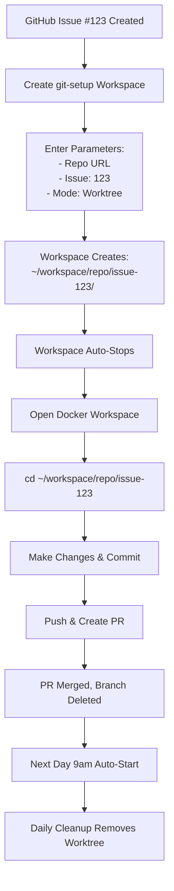

# Coder Templates - Claude Code Guide

This directory contains Coder workspace templates for issue-based development workflow with git worktrees.

## Templates Overview

### 1. Docker Template (`docker/`)
**Purpose:** Main development workspace
**Use case:** Daily development work, long-running workspace

**Key Features:**
- Daily worktree cleanup (removes worktrees for deleted branches)
- Persistent home volume (shared across workspaces or workspace-specific)
- Full IDE support: code-server, JetBrains, Cursor
- Docker-in-Docker (dind) for container development
- Automatic cleanup runs once per day on startup (9am auto-start)

**When to use:**
- Your primary development workspace
- Working on code in existing worktrees
- Need IDE integrations and Docker support

### 2. Git Setup Template (`git-setup/`)
**Purpose:** One-time workspace for repository setup
**Use case:** Creating new worktrees or cloning repositories

**Key Features:**
- Creates worktrees in `~/workspace/repo-name/issue-123/`
- Three modes: Worktree (recommended), Clone, Checkout
- Auto-stops after setup completion (~10 seconds)
- Shares same home volume as development workspaces
- Handles issue number overlap across different repositories

**When to use:**
- Starting work on a new GitHub issue
- Creating a worktree for a new feature branch
- Switching between different repositories

## Architecture

### Directory Structure

```
/home/coder/  (persistent volume, shared across all workspaces)
├── repos/
│   ├── repo-1/  (bare repository)
│   ├── repo-2/  (bare repository)
│   └── repo-3/  (bare repository)
└── workspace/
    ├── repo-1/
    │   ├── issue-123/  (worktree for issue #123)
    │   ├── issue-456/  (worktree for issue #456)
    │   └── feature-xyz/  (worktree for custom branch)
    ├── repo-2/
    │   └── issue-123/  (different repo, same issue number - OK!)
    └── repo-3/
        └── main/  (worktree for main branch)
```

### Volume Strategy

**Persistent Home Volume:**
- Volume name: `coder-<user-id>-home` (when persistent_volume=true)
- Shared across ALL workspaces for the same user
- Contains: dotfiles, shell config, SSH keys, bare repos, worktrees

**Benefits:**
- One bare repository clone shared across all worktrees
- Worktrees created by git-setup accessible from docker workspace
- Settings and configurations persist across workspace recreations

## Workflow

### Standard Issue-Based Workflow



### Step-by-Step Example

**1. Create Worktree for Issue**
```
Coder UI → Create Workspace
  Template: git-setup
  Git Repository: https://github.com/org/my-repo
  Issue Number: 123
  Setup Mode: Create Worktree

→ Creates: ~/workspace/my-repo/issue-123/
→ Workspace stops automatically
```

**2. Work in Development Workspace**
```bash
# In your docker workspace
cd ~/workspace/my-repo/issue-123

# Work on the issue
git status
# ... make changes ...
git add .
git commit -m "fix: resolve issue #123"
git push origin issue-123

# Create PR via GitHub UI or gh CLI
gh pr create --title "Fix issue #123"
```

**3. Automatic Cleanup**
```
PR merged → Branch deleted on GitHub
↓
Next morning 9am: Docker workspace auto-starts
↓
Daily cleanup script runs:
  - Fetches from origin
  - Detects branch 'issue-123' is deleted
  - Removes ~/workspace/my-repo/issue-123/
  - Updates timestamp to prevent re-run today
```

## Common Operations

### Creating Worktrees

**For GitHub Issue:**
```
Template: git-setup
Repository: https://github.com/org/repo
Issue Number: 456
Setup Mode: Create Worktree
```

**For Custom Branch:**
```
Template: git-setup
Repository: https://github.com/org/repo
Branch Name: feature-authentication
Setup Mode: Create Worktree
```

**Fresh Clone (not worktree):**
```
Template: git-setup
Repository: https://github.com/org/repo
Setup Mode: Clone Fresh
```

### Managing Worktrees

**List all worktrees:**
```bash
cd ~/repos/repo-name
git worktree list
```

**Manual cleanup (if needed):**
```bash
cd ~/repos/repo-name
git worktree remove ~/workspace/repo-name/issue-123
git worktree prune
```

**Create worktree manually:**
```bash
cd ~/repos/repo-name
git fetch origin
git worktree add ~/workspace/repo-name/issue-789 issue-789
```

### Working with Multiple Repositories

**Scenario:** Working on issues across multiple repos

```bash
# Repository structure
~/repos/
  ├── frontend/  (bare)
  ├── backend/   (bare)
  └── docs/      (bare)

~/workspace/
  ├── frontend/
  │   ├── issue-100/  # Frontend issue
  │   └── issue-200/
  ├── backend/
  │   ├── issue-100/  # Backend issue (same number, different repo!)
  │   └── issue-150/
  └── docs/
      └── issue-300/

# Switch between issues
cd ~/workspace/frontend/issue-100
cd ~/workspace/backend/issue-100
cd ~/workspace/docs/issue-300
```

## Troubleshooting

### Worktree already exists

**Problem:** Git-setup reports "Worktree already exists"

**Solution:** The worktree was already created. Just use it:
```bash
cd ~/workspace/repo-name/issue-123
git status
```

### Bare repository not found

**Problem:** "Error: Bare repository not found"

**Solution:** Use "Clone Fresh" mode first, then switch to "Worktree" mode for subsequent branches.

### Cleanup not running

**Problem:** Deleted branches' worktrees still exist

**Causes:**
1. Cleanup hasn't run yet (runs once per day)
2. Today's cleanup already ran (check: `cat ~/.worktree_cleanup_timestamp`)

**Manual cleanup:**
```bash
cd ~/repos/repo-name
git fetch --prune origin
git worktree prune
```

### Disk space issues

**Problem:** Home volume running out of space

**Check usage:**
```bash
du -sh ~/repos/*
du -sh ~/workspace/*/*
```

**Clean up old worktrees:**
```bash
# Remove all worktrees for deleted branches
for repo in ~/repos/*; do
  cd "$repo"
  git fetch --prune origin
  git worktree prune
done
```

## Best Practices

### 1. Use Git-Setup for Setup, Docker for Work

❌ **Don't:** Try to do development in git-setup workspace
✅ **Do:** Use git-setup only to create worktrees, then work in docker workspace

### 2. One Issue = One Worktree

❌ **Don't:** Reuse the same worktree for multiple issues
✅ **Do:** Create a new worktree for each issue/feature

### 3. Let Automatic Cleanup Work

❌ **Don't:** Manually delete worktree directories
✅ **Do:** Delete the branch on GitHub, let daily cleanup remove worktree

### 4. Use Persistent Volume

❌ **Don't:** Use workspace-specific volumes (loses data on recreation)
✅ **Do:** Enable "영구 홈 볼륨 사용" (persistent_volume=true)

### 5. Consistent Naming

❌ **Don't:** Mix naming conventions (issue-123, feature/auth, etc.)
✅ **Do:** Use consistent branch names (issue-N or descriptive names)

## Template Parameters Reference

### Docker Template

| Parameter | Description | Default | Notes |
|-----------|-------------|---------|-------|
| `persistent_volume` | Use shared home volume | `false` | Set to `true` for worktree workflow |
| `base_image` | Docker image to use | `ghcr.io/chatbot-pf/coder-base-image:main` | Custom images supported |

### Git-Setup Template

| Parameter | Description | Example | Required |
|-----------|-------------|---------|----------|
| `git_repo` | Repository URL | `https://github.com/org/repo` | Yes |
| `issue_number` | GitHub issue number | `123` | No* |
| `branch_name` | Custom branch name | `feature-auth` | No* |
| `setup_mode` | Setup operation | `Create Worktree` | Yes |
| `base_image` | Docker image | `ghcr.io/chatbot-pf/coder-base-image:main` | Yes |

*Either `issue_number` or `branch_name` required

### Setup Modes

| Mode | Description | Creates | Use Case |
|------|-------------|---------|----------|
| **Create Worktree** | Create git worktree | `~/workspace/repo/branch/` | Recommended for most cases |
| **Clone Fresh** | Full git clone | `~/workspace/repo/` | First-time setup or standalone clone |
| **Checkout Branch** | Update existing worktree | Updates existing | Switching branches in worktree |

## Integration with Development Tools

### IDE Configuration

All IDEs open to the worktree directory automatically:

**code-server:**
```
Opens to: ~/workspace/repo-name/issue-123/
```

**JetBrains:**
```
Folder: /home/coder
Navigate to: workspace/repo-name/issue-123/
```

**Cursor:**
```
Opens to: ~/workspace/repo-name/issue-123/
```

### Git Configuration

Git credentials are pre-configured via Coder:

```bash
# Already set in workspace
GIT_AUTHOR_NAME=Your Name
GIT_AUTHOR_EMAIL=your.email@example.com
GIT_COMMITTER_NAME=Your Name
GIT_COMMITTER_EMAIL=your.email@example.com
```

### GitHub CLI

GitHub authentication is handled by Coder external auth:

```bash
# Works automatically
gh pr create
gh pr list
gh issue list
```

## Scheduling

### Automatic Start/Stop

**Default Schedule:**
- **Auto-start:** Monday-Friday 9:00 AM
- **Auto-stop:** After 4 hours of inactivity

**Cleanup Timing:**
- Runs at: 9:00 AM (on auto-start)
- Frequency: Once per day
- Marker: `~/.worktree_cleanup_timestamp`

### Manual Control

**Start workspace early:**
```
Coder UI → Workspace → Start
```

**Stop workspace:**
```
Coder UI → Workspace → Stop
```

**Extend runtime:**
```bash
# Workspace stays active while you're working
# Inactivity timer resets on terminal/IDE activity
```

## Future Enhancements

### Planned Features

1. **Workspace Isolation**
   - Per-issue workspaces with separate containers
   - Resource limits per workspace
   - Enhanced security isolation

2. **Automatic PR Integration**
   - Auto-create worktree when assigned to issue
   - Remove worktree on PR merge (via webhook)

3. **Multi-Repository Support**
   - Cross-repo dependency management
   - Monorepo worktree strategies

4. **Performance Optimization**
   - Shallow clone support
   - Sparse checkout for large repos
   - Git LFS optimization

## Additional Resources

- **Template Source:** `templates/docker/` and `templates/git-setup/`
- **Base Image:** Docker image configuration in `images/base/`
- **Coder Docs:** https://coder.com/docs
- **Git Worktree:** https://git-scm.com/docs/git-worktree

## Questions?

For template issues or improvements:
1. Check this guide first
2. Review template README files
3. Create GitHub issue in this repository